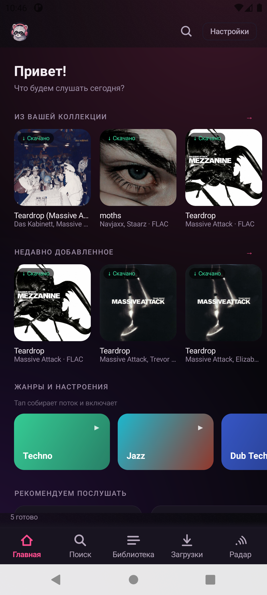
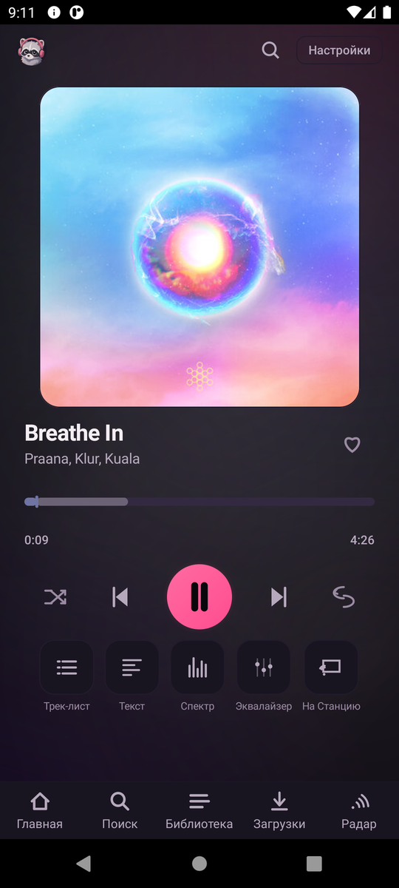
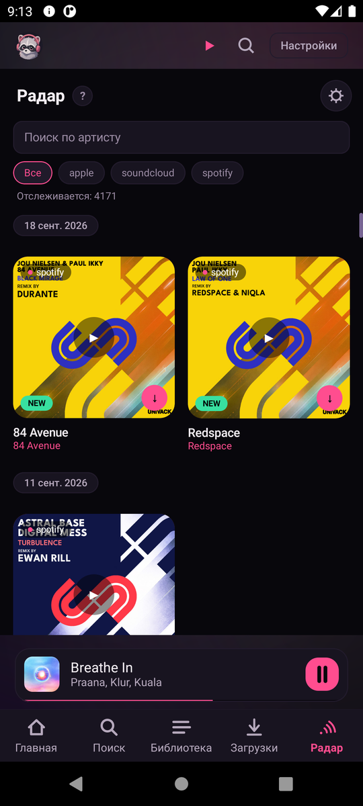

# Ripster Mobile

Native Android app for downloading and playing lossless music from **Deezer,
Qobuz, Tidal, SoundCloud and Yandex Music**. Pair it with a PC running
[desktop Ripster](https://github.com/Raccoon-Trashpanda/Raccoon-Ripster) to add
**Apple Music** and **Spotify** link conversion, and to sync your service logins
from the PC.

Runs on the phone. No account with us, no cloud. The only server it talks to is
your own copy of desktop Ripster, and only if you pair.

You need your own subscription for each service. Ripster downloads from services
you already pay for; it does not provide accounts or unlock paid tiers.

## Contents

- [Features](#features)
- [Codecs & engines](#codecs--engines)
- [Standalone vs. paired](#standalone-vs-paired)
- [Install](#install)
- [First launch](#first-launch)
- [Pairing](#pairing)
- [Connecting services](#connecting-services)
- [Audio engine](#audio-engine)
- [Updating](#updating)
- [Build from source](#build-from-source)
- [Permissions](#permissions)
- [Credits](#credits)
- [Disclaimer](#disclaimer)

## Features

- Download FLAC up to 24-bit/192 kHz from Deezer, Qobuz and Tidal (Tidal HI-RES
  over MPEG-DASH), lossless or high-AAC from SoundCloud, FLAC from Yandex Music.
- Search all connected services from one field, with ▶ preview and one-tap queue.
- Player with two backends: the OS codec (default) or a native Oboe engine
  (AAudio exclusive, no resample when rates match) for local FLAC/WAV/ALAC, with
  a gapless queue.
- Equalizer, bass boost, virtualizer and the engine switch under **Settings →
  Equalizer & effects**.
- Spectrogram with a lossless / upscale verdict.
- Line-by-line lyrics, active line centred.
- Ripster Radar: release feed for the artists and labels you follow, sticky date
  headers, per-service filter, ▶ streams from the card.
- 6 themes, UI in English, Russian, Hindi, Japanese, Chinese.
- Scans a folder you pick for your existing music.

Requires pairing with a PC:

- Apple Music in ALAC, through the PC's decrypt wrapper.
- Spotify link conversion (the PC does the lookup; the phone never calls
  `api.spotify.com`).
- Service logins copied from the PC and refreshed as the PC rotates them.
- Radar from the PC watchlist, plus the "new for you" signal.
- Artist and label discography pages from the PC's engines.
- Phone plays and downloads written back to the PC's history.

## Screenshots

| Home | Player | Radar |
|---|---|---|
| [](screenshots/01_home.png) | [](screenshots/02_player.png) | [](screenshots/03_radar.png) |

## Codecs & engines

**Codecs** — `FLAC`, `ALAC`, `WAV` decode straight through the native engine
(no resample when the device rate matches); `AAC` / `M4A`, `MP3`, `Vorbis` (OGG)
and `Opus` play through the system engine. Tags are written as Vorbis comments
(FLAC), ID3 (MP3) or MP4 atoms (M4A). Actual bit-depth / sample-rate depends on
the release and your subscription — the quality badge never invents a number it
can't measure.

**Source engines** — Deezer (FLAC 16/44, Blowfish decrypt, your `arl`) ·
Qobuz (FLAC up to 24/192) · Tidal (FLAC + HI-RES over MPEG-DASH) ·
SoundCloud (lossless where offered, else high AAC) · Yandex Music (FLAC with
Plus) · BBC (public). **Through a paired PC:** Apple Music (ALAC via the PC's
decrypt wrapper) and Spotify (link conversion only — the PC finds the same
track on a service you have).

**Playback** — `ExoPlayer / Media3` by default (every source, streaming and
local, MediaSession, Bluetooth); `Oboe · AAudio exclusive` for local
FLAC/WAV/ALAC (gapless, no resample, bit-perfect readout).

## Standalone vs. paired

| | Phone only | Paired with a PC |
|---|:---:|:---:|
| Deezer, Qobuz, Tidal, SoundCloud, Yandex — search & download | yes, your logins | yes, logins synced |
| Player, EQ & effects, native engine | yes | yes |
| Spectrogram, lyrics, themes, i18n | yes | yes |
| Local library | yes | yes |
| Ripster Radar | manual follow list | PC watchlist + Live signal |
| Apple Music (ALAC) | no | yes |
| Spotify link conversion | no | yes |
| Artist / label pages | search fallback | PC engines |
| History on the PC | no | yes |

Pairing is optional and can be done later in **Settings → PC pairing**.

## Install

Not on Google Play. Sideload the APK:

1. Open [Releases](https://github.com/Raccoon-Trashpanda/Raccoon-Ripster-Mobile/releases)
   on the phone and download `Ripster-Mobile-<version>.apk`.
2. Tap the file, allow installs from that source, confirm.
3. Open Ripster.

Android 8.0 (API 26) or newer. The APK carries `arm64-v8a` and `x86_64`.

## First launch

A one-time setup: language, theme, text size, download folder, then an optional
pairing step. Skip pairing to run standalone.

## Pairing

On the PC, in desktop Ripster open **Settings → PC pairing** and press
**Show code** — an 8-digit code, valid a few minutes.

On the phone, in the setup step or **Settings → PC pairing**:

1. Enter the PC address, usually `http://<PC-LAN-IP>:7799` on the same network.
   An emulator reaches the host at `http://10.0.2.2:7799`.
2. Enter the code, tap **Pair**.

The phone pulls the service tokens, pairing mode and Apple storefront, and
registers the clients. It re-syncs rotated tokens whenever it can reach the PC.

Turning off Wi-Fi does not unpair — the token is on the device. The phone falls
back to standalone until it sees the PC again.

## Connecting services

Connect each service on the phone in **Settings → Accounts**, or pair with a PC
and skip it.

| Service | Needs |
|---|---|
| Deezer | `arl` cookie |
| Qobuz | auth token, or email + password |
| Tidal | access token (paste, or sync from PC) |
| SoundCloud | nothing for public tracks; OAuth token for more |
| Yandex Music | OAuth token |
| Apple Music | PC pairing only |
| Spotify | PC pairing only (link conversion, not audio) |
| BBC | nothing |

## Audio engine

**Settings → Equalizer & effects → Audio engine.**

- **System (ExoPlayer)** — default, handles every source.
- **Native (Oboe)** — beta. For local FLAC/WAV/ALAC only: decodes and feeds an
  AAudio exclusive stream directly, gapless, with a bit-perfect / "resampled →
  N Hz" readout on Now Playing. Other tracks fall back to the system engine.

The ALAC path plays Apple Lossless files you already have. It is playback, not
FairPlay removal — Apple Music downloads still need a paired PC.

## Updating

Sideloaded, so no automatic updates. Download the newest
`Ripster-Mobile-<version>.apk` from
[Releases](https://github.com/Raccoon-Trashpanda/Raccoon-Ripster-Mobile/releases)
and install over the current app. Settings, logins, pairing and music are kept.

An in-app update check is on the roadmap.

## Build from source

Needs JDK 17, the Android SDK (compileSdk 34), and the NDK `26.3.11579264` with
CMake 3.22.1 for the native audio module.

```bash
git clone https://github.com/Raccoon-Trashpanda/Raccoon-Ripster-Mobile.git
cd Raccoon-Ripster-Mobile
echo "sdk.dir=/path/to/Android/Sdk" > local.properties
./gradlew assembleDebug
```

Output in `app/build/outputs/apk/debug/`. Android Studio works too.

Release signing keys are not in the repo. For a signed release, add to
`local.properties` (git-ignored) or the environment:

```properties
RIPSTER_RELEASE_STORE_FILE=ripster-release.jks
RIPSTER_RELEASE_STORE_PASSWORD=…
RIPSTER_RELEASE_KEY_ALIAS=…
RIPSTER_RELEASE_KEY_PASSWORD=…
```

Without them `assembleRelease` still runs and produces an unsigned APK.

Stack: Kotlin, Jetpack Compose (Foundation only, no Material), Media3/ExoPlayer,
Oboe + dr_libs + Apple's ALAC decoder over the NDK, Room, WorkManager, OkHttp,
kotlinx.serialization, Coil.

## Permissions

| Permission | Use |
|---|---|
| `INTERNET`, `ACCESS_NETWORK_STATE` | streaming, downloading |
| `FOREGROUND_SERVICE*`, `WAKE_LOCK`, `POST_NOTIFICATIONS` | downloads and playback in the background |
| `READ_MEDIA_AUDIO` / `READ_EXTERNAL_STORAGE` (≤ API 32) | scan your music library |
| `MODIFY_AUDIO_SETTINGS` | equalizer, bass boost, virtualizer |
| `CHANGE_WIFI_MULTICAST_STATE`, `ACCESS_WIFI_STATE` | mDNS discovery of Yandex Station |

## Credits

The download and decode work builds on open-source projects:

- [google/oboe](https://github.com/google/oboe) — AAudio/OpenSL audio
- [mackron/dr_libs](https://github.com/mackron/dr_libs) — `dr_flac`, `dr_wav`
- [macosforge/alac](https://github.com/macosforge/alac) — Apple Lossless decoder
- [androidx/media](https://github.com/androidx/media) — Media3 / ExoPlayer
- [square/okhttp](https://github.com/square/okhttp),
  [Kotlin](https://github.com/JetBrains/kotlin),
  [kotlinx.serialization](https://github.com/Kotlin/kotlinx.serialization),
  [kotlinx.coroutines](https://github.com/Kotlin/kotlinx.coroutines)
- [coil-kt/coil](https://github.com/coil-kt/coil) — image loading
- [Adonai/jaudiotagger](https://github.com/Adonai/jaudiotagger) — FLAC/MP3/M4A tags
- [nathom/streamrip](https://github.com/nathom/streamrip) — reference for the
  download logic
- Metadata: [Deezer](https://developers.deezer.com/api),
  [Qobuz](https://www.qobuz.com/api.json/0.2),
  [Tidal](https://developer.tidal.com/documentation),
  [MarshalX/yandex-music-api](https://github.com/MarshalX/yandex-music-api),
  [iTunes Search API](https://performance-partners.apple.com/search-api)
- [desktop Ripster](https://github.com/Raccoon-Trashpanda/Raccoon-Ripster) — the
  PC side of pairing

## Disclaimer

Not affiliated with Apple, Spotify, Qobuz, Tidal, Deezer, SoundCloud or Yandex.
Trademarks belong to their owners. For personal use — follow each provider's
terms and download only what you are entitled to.
